# Gestor de prestamos *Prestaplus MJ*

## Integrantes
- Grace Sabogal Velasco  
- Daniela Duque Arango  
- Laura Cristina Pérez Bedoya  
- luz Adriana Valencia Ramírez  

## Vinculos académicos y descripción

| Nombre | Carrera | Habilidades | Fortalezas |
|--------|--------|------------|------------|
| Grace Sabogal Velasco | Ingeniería Industrial | Trabajo en equipo, compartir conocimientos, trabajo bajo presión, resolución de problemas | Responsabilidad, honestidad, compromiso, apoyo a los demás |
| Daniela Duque Arango | Ingeniería Industrial | Análisis, toma de decisiones, trabajo en equipo, manejo emocional | Disciplina, mejora continua, compromiso, empatía |
| Laura Cristina Pérez Bedoya | Ingeniería Industrial | Análisis, pensamiento crítico, organización, multitareas | Responsabilidad, organización, constancia, compromiso |
| Luz Adriana Valencia Ramírez | Ingeniería Industrial | Responsabilidad, disciplina, resiliencia, orientación a resultados | Comunicación, trabajo en equipo, organización, inteligencia emocional |

## Descripción del proyecto

Con el fin de dar solución a los prestamos de articulos que el señor Michael Jackson Gamboa realiza, se pretende desarollar un aplicativo que permita controlar lo que se presta, a quien se le presta y disponibilidad de los diferentes articulos, con el fin de ejercer un mayor control en relación a la gestión de los prestamos 

## Licencia del software
La licencia que se ha definido para el registro del software es "MIT license" 

## Reporte de visión
Una plataforma digital de gestión para el proyecto Gestor de prestamo "Prestaplus MJ", Debido a la situación de Michael Jackson Gamboa (MJ), surge la necesidad de desarrollar un sistema que permita gestionar de manera organizada los préstamos, devoluciones y notificaciones, evitando confusiones y pérdidas de inventario.

### Objetivos

* Desarrollar un programa en Python que permita a MJ gestionar su inventario de objetos prestados.
* Registrar préstamos y devoluciones.
* Generar notificaciones automáticas para garantizar la recuperación o venta de los artículos.
* Reducción de pérdidas de artículos.
* Automatizar la generación de certificados y facturas.
* Consulta rápida del estado de los préstamos.

### Reglas de negocio

El sistema incluirá funciones para generar recordatorios automáticos después de cierto tiempo, así como notificaciones para solicitar la devolución de los objetos cuando se presenten retrasos. En caso de que un objeto no sea devuelto dentro del tiempo establecido, el sistema permitirá ejecutar un proceso de venta, generando una factura con el valor correspondiente.

### Beneficios

* Organización del inventario.
* Reducción de pérdidas de objetos.
* Mejor control de préstamos.
* Automatización de recordatorios.
* Mayor responsabilidad de los usuarios.
* Posibilidad de consultar la información en cualquier momento de forma clara y organizada.

## Especificación de requisitos 

### Requisitos funcionales
El sistema debe permitir:

* Registrar usuarios.
* Iniciar sesión.
* El sistema debe validar que el correo electrónico tenga formato válido (incluya “@” y termine en “.com”). 
* Registrar artículos disponibles para préstamo.
* Prestar artículos a los usuarios.
* Registrar la fecha de préstamo y devolución.
* Devolver artículos y generar certificado de devolución.
* Mostrar la disponibilidad de los artículos.
* Generar alertas de retraso en devoluciones.
* Permitir consultar historial de préstamos.
* Permitir editar y eliminar registros.
* Exportar información a CSV.
* Guardar información.

### Requisitos no funcionales

* La aplicación debe ser fácil de usar (interfaz intuitiva).
* Debe ser desarrollado en Phyton.
* El sistema debe responder en menos de 3 segundos.
* La información debe almacenarse de forma segura.
* El sistema debe estar disponible el 95% del tiempo.
* Debe permitir acceso desde computador o celular.

### Usuarios del sistema

* Usuario principal: Michael Jackson Gamboa
* Usuarios secundarios: Personas registradas que solicitan préstamos

### Entradas del sistema

* Datos del usuario
* Datos del artículo
* Fechas de préstamo y devolución

### Salidas del sistema

* Listado de artículos disponibles
* Reporte de préstamos
* Alertas de retrasos

## Plan del Proyecto

Para el desarrollo del sistema Prestaplus MJ, se definieron las siguientes actividades, teniendo en cuenta las necesidades del caso y los requerimientos planteados:

* Análisis del problema y comprensión del funcionamiento actual de los préstamos en MJ 
* Definición de requisitos del sistema (usuarios, ítems, préstamos y ventas) 
* Diseño de la estructura general del sistema (menú y módulos principales) 
* Diseño de la lógica para el manejo de inventario y control de préstamos 
* Desarrollo del módulo de registro de usuarios con sus respectivas validaciones 
* Desarrollo del módulo de registro de ítems, incluyendo categorías, identificación única y estado 
* Desarrollo del módulo de préstamos con validaciones de disponibilidad y restricción de usuarios 
* Desarrollo del módulo de devoluciones con generación de certificados 
* Implementación de notificaciones automáticas cuando se superen los 20 días de préstamo 
* Desarrollo del módulo de ventas con cálculo de impuesto del 23% y generación de factura 
* Implementación del almacenamiento de datos en archivos planos 
* Desarrollo del módulo administrador con autenticación 
* Generación de reportes del sistema 
* Realización de pruebas conceptuales para validar la lógica antes del código 
* Corrección de errores y ajustes del sistema 
* Documentación del proyecto y organización del repositorio en GitHub 

```mermaid
gantt
    title Cronograma Proyecto Gestor de Préstamos
    dateFormat  D
    axisFormat %d

    section Planeación
    Análisis del problema        :a1, 1, 2d
    Definición de requisitos     :a2, 1, 2d

    section Diseño
    Diseño del sistema           :a3, 3, 2d
    Diseño de lógica             :a4, 3, 2d

    section Desarrollo
    Registro de usuarios         :a5, 5, 2d
    Registro de ítems            :a6, 5, 2d
    Módulo de préstamos          :a7, 7, 2d
    Pruebas conceptuales         :a8, 7, 2d
    Desarrollo en Python         :a9, 9, 2d
    Funcionalidades finales      :a10, 11, 2d

    section Cierre
    Pruebas del sistema          :a11, 11, 2d
    Manual de usuario            :a12, 13, 2d
    Organización GitHub          :a13, 13, 2d
    Preparación sustentación     :a14, 15, 2d 
```

## Presupuesto del proyecto

El desarrollo del proyecto no representa un costo económico directo, ya que se realiza como parte del proceso de formación académica. En este caso, el recurso principal es el tiempo invertido por los integrantes del equipo.

El grupo está conformado por cuatro estudiantes, quienes dedicarán un total de 50 horas de trabajo para el desarrollo completo del proyecto. Estas horas corresponden a tiempo de práctica de formación.

De acuerdo con los lineamientos establecidos, este tiempo será valorado como práctica profesional, equivalente a un (1) Salario Mínimo Legal Vigente (SMLV).
